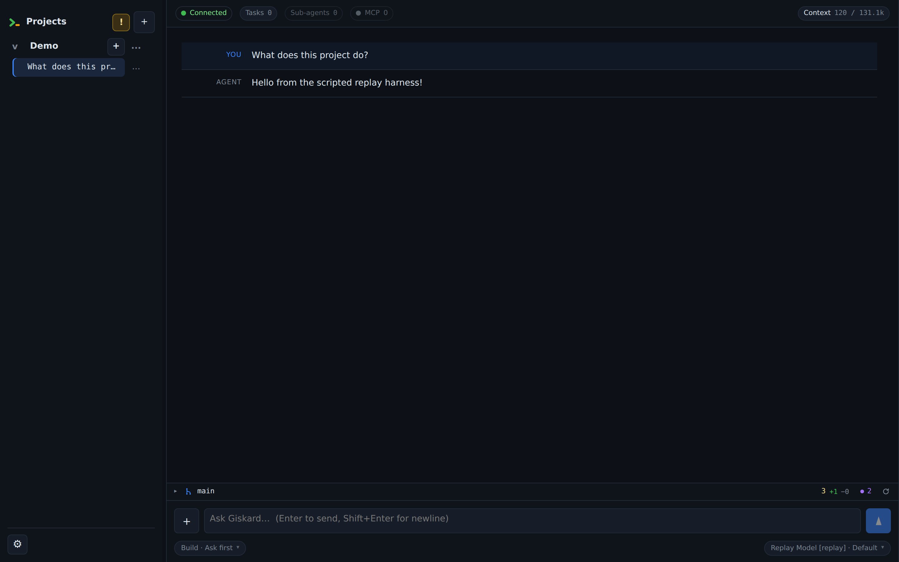
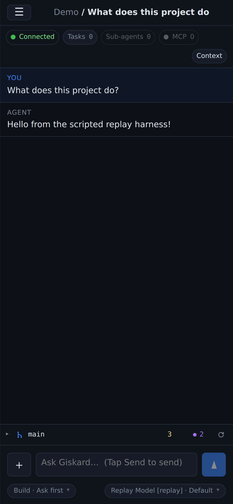

# Giskard

[](https://github.com/marmeladema/Giskard/actions/workflows/ci.yml)

**Giskard is a self-hosted web UI for agentic coding CLIs.** It runs on your own machine — no cloud,
no account — managing projects and durable conversation threads, streaming the agent's work to your
browser in real time, and visualizing file diffs, referenced source, and token usage.

It ships as a **single self-contained Rust binary**: the whole UI is compiled in, with no npm/Node
and no separate assets to build or serve. Drop it on a machine, point it at a data directory, and run.

> The authoritative design document is [`specs/giskard-specification.md`](specs/giskard-specification.md).
> This README is the practical setup/usage guide and must be kept in sync with the code (see
> [AGENTS.md](AGENTS.md)).

---

## Screenshots

The browser UI in its default **Professional (IDE)** theme: a sidebar of projects and durable
threads on the left, the agent's live-streaming transcript in the center, and a composer with
per-turn mode/model controls and context-usage tracking. The layout collapses to a single column
with a slide-in drawer on mobile.

**Desktop**



**Mobile**



These are generated from the real UI (no host Node/npm needed) with `tests/e2e/screenshots.sh` — see
[§Development](#development).

---

## Supported harnesses

The agent harness is a replaceable component behind a neutral `AgentHarness` trait:

- **[Codex CLI](https://github.com/openai/codex) — supported, and required today.** Giskard drives
  Codex over its `app-server` JSON-RPC protocol. A working, authenticated Codex CLI must be installed
  on the machine (see [Prerequisites](#prerequisites)); without it you can create projects, but turns
  fail.
- **Claude Code — not yet supported.** The trait makes it addable without touching the rest of the
  app; it just hasn't been built yet. _(Anthropic, if you're reading this: a generous pile of Claude
  credits would move this up the roadmap_ 😁_.)_

---

## Prerequisites

- **Rust** — edition 2024, MSRV **1.88+** (`rustup` recommended).
- **Codex CLI**, already installed and authenticated on the machine. Giskard does **not** manage
  Codex's credentials — it inherits `~/.codex` (ChatGPT login or an API key / custom provider) when
  it spawns the app-server. If Codex isn't configured, turns will fail with an "unauthenticated"
  message. See [§12.2 of the spec](specs/giskard-specification.md).

Giskard spawns one `codex app-server` process per project; each project is bound to a filesystem
directory that becomes the agent's sandbox/workspace.

---

## Installation

The repository root is a virtual Cargo workspace, so `cargo install --path .` is not valid. Install
the two binaries from their package manifests instead:

```bash
cargo install --locked --path crates/giskard-server --bin giskard-server
cargo install --locked --path crates/giskard-persist --bin giskard-admin
```

Cargo installs binaries into `~/.cargo/bin` by default; make sure that directory is on `PATH`.
`giskard-server` serves the browser app, while `giskard-admin` manages passwords and stored data.

If you prefer not to install, run the same binaries from the checkout with `cargo run` as shown in
the quick start below.

---

## Quick start

With the installed binaries:

```bash
# 1. Choose a data directory (holds config, projects, threads, token ledgers).
#    Defaults to ~/.local/share/giskard; override with GISKARD_DATA_DIR.
export GISKARD_DATA_DIR="$HOME/.local/share/giskard"
mkdir -p "$GISKARD_DATA_DIR"

# 2. Set the app password (prints an Argon2 hash to paste into config.toml).
giskard-admin set-password

# 3. Create the config from the annotated example and edit it (paste the hash;
#    keep secure_cookies = false for plain-HTTP localhost).
cp config.example.toml "$GISKARD_DATA_DIR/config.toml"
$EDITOR "$GISKARD_DATA_DIR/config.toml"

# 4. Run the server.
giskard-server
```

From the checkout without installing, use the package binaries explicitly:

```bash
cargo run -p giskard-persist --bin giskard-admin -- set-password
cargo run --release -p giskard-server --bin giskard-server
```

Then open **http://127.0.0.1:8787**, log in, and:

1. **+** next to *Projects* → name it and give an **absolute directory path** that exists on the
   server machine (the agent's workspace).
2. **+** on the project → draft a new thread. No Codex thread is created until the first message is
   sent, so choose the **Plan/Build** mode, **permission preset**, and **model** first if needed.
   A draft on a Git project also picks its **Git checkout** from the dropdown on the **Git status
   row** above the composer: shared with the project, or a **Git worktree** of its own, so its file
   changes never touch the project's checkout. Choosing a worktree while the project has uncommitted
   work prints how much of it stays behind. The choice is
   available only on the draft — the workspace is fixed once the thread exists. Isolation changes where the thread works, not what it
   is allowed to do: its permission preset still applies unchanged. See
   [Per-thread Git worktrees](docs/git-worktrees.md) for what does and does not come across, branch
   naming, and what deleting an isolated thread destroys.
3. Type in the composer (Enter to send). Use the attachment button or drop files onto the composer
   to include images, PDFs, or other files with the message. A message accepts up to eight files
   and 25 MiB total. The first send creates the Codex thread with the selected
   provider/model and starts the turn. Existing threads show the **Tasks** menu for running
   commands/tools, **Sub-agents** monitor, **MCP** status menu, and **Context** usage button;
   scrolling the transcript to the top lazy-loads older history. When the project's workspace is a
   Git repository, a one-line **Git status** sits just above the composer — branch, ahead/behind,
   changed-file count and total diffstat — and expands in place into the changed files, each
   opening its diff. It refreshes as the agent changes the tree, so it stays current during a turn.
   For a thread isolated in a worktree, the row reports that worktree rather than the project's
   checkout.
4. Linked child threads appear in the **Sub-agents** monitor and can be opened from their activity
   rows; their header **Parent** button returns to the owning thread. See
   [Sub-agent threads](docs/subagents.md) for spawning protocols, monitoring, prompts, direct
   follow-ups, ownership, and deletion behavior.

The header context value is a context-window indicator, not a billing total. Codex currently exposes
the latest turn's input tokens rather than a dedicated context-occupancy field, so Giskard uses that
as the best available proxy for "how full is the active conversation?" Clicking **Context** opens a
card with both the current context footprint and cumulative input/output/total tokens. Those
cumulative totals can legitimately exceed the model's context window over a long thread.

> **Common gotcha:** with `secure_cookies = true` over plain HTTP, the browser drops the session
> cookie — login appears to succeed but nothing loads. Use `false` for local HTTP; set `true` only
> behind HTTPS/TLS (e.g. an Nginx terminator).

---

## Logging

`giskard-server` logs to the server process output using Rust's standard `RUST_LOG` filter syntax.
When `RUST_LOG` is unset, the server defaults to:

```bash
giskard=info,tower_http=info
```

For normal debugging, start the server with Giskard logs at `debug`:

```bash
RUST_LOG=giskard=debug,tower_http=info giskard-server
```

From a checkout:

```bash
RUST_LOG=giskard=debug,tower_http=info \
  cargo run --release -p giskard-server --bin giskard-server
```

For verbose turn-lifecycle, Codex harness, and HTTP request diagnostics, use `trace` selectively:

```bash
RUST_LOG=giskard=trace,giskard_harness_codex=trace,tower_http=debug giskard-server
```

If the output is too noisy, scope logging to the area being diagnosed. For example, this focuses on
thread turn ownership and Codex harness events while keeping the rest of Giskard at `info`:

```bash
RUST_LOG=giskard_server::registry=trace,giskard_harness_codex=trace,giskard=info,tower_http=info \
  giskard-server
```

Use `debug` first for most issues. `trace` can be very verbose, but it is useful when diagnosing
stuck turns, harness protocol failures, WebSocket forwarding, or command/tool lifecycle bugs.

For browser-side issues, open Settings → **Browser diagnostics** in the Giskard UI. The panel keeps
a bounded local buffer of recent WebSocket status changes, notification lifecycle events, approval
routing decisions, and visibility/focus state. Use **Copy** from that panel when reporting a
browser-only problem; **Test notification** verifies the browser/OS notification path without
waiting for an approval request.

---

## Configuration

Config lives at `${GISKARD_DATA_DIR:-~/.local/share/giskard}/config.toml`. A fully annotated,
copy-pasteable template is in [`config.example.toml`](config.example.toml). Every section is
optional and falls back to the defaults below, but the `config.toml` file itself must exist:
`giskard-server` refuses to start when it is missing, unreadable, or invalid so a mis-pointed
service does not silently run with an empty provider list.

| Section | Key | Default | Purpose |
|---------|-----|---------|---------|
| `[server]` | `bind` | `127.0.0.1:8787` | HTTP/WS listen address. |
| | `secure_cookies` | `true` | `Secure` flag on the session cookie. **Set `false` for plain-HTTP local dev.** |
| `[auth]` | `password_hash` | — | Argon2 hash of the shared password (or env `GISKARD_PASSWORD_HASH`). Generate with `giskard-admin set-password`. |
| | `session_days` | `30` | Session lifetime, sliding: requests in the second half of the window re-issue the cookie for a full window. |
| `[browse]` | `roots` | `[]` (whole FS) | Confine the filesystem picker **and project creation** to these absolute subtrees (see [Security](#security)). |
| `[plan]` | `default_dir` / `filename_template` | `docs` / `plan-{slug}-{ts}.md` | Where "Save plan to project" writes. |
| `[tokens]` | `cost_estimation` | `false` | Show an estimated € cost from `[tokens.rates."provider/model"]`. |
| `[viz]` | `max_highlight_size` | `10485760` (10 MiB) | Files larger than this aren't syntax-highlighted. |
| `[history]` | `initial` / `page` | `5` / `5` | Turns fetched on open (topped up client-side to ~2 screens) / per scroll-up page. |
| `[harness]` | `kind` | `codex` | Agent harness (v1: `codex`). |
| | `idle_shutdown_secs` | `0` (keep alive) | Terminate an idle project's harness after N seconds. |
| `[providers.<id>]` | `model_listing`, `[[providers.<id>.models]]` | — | Which `(provider, model)` pairs the picker offers, keyed by routing id the same way Codex keys `[model_providers.<id>]`. The id must name a provider Codex knows (see below). With `model_listing = true` the list is topped up from `GET {base_url}/models` — using the endpoint and key Codex has for that provider — so the models list becomes optional. Providers appear in the picker in the order declared. |

Provider config governs the **picker** and optional `/v1/models` discovery only — Codex itself
reads `~/.codex/config.toml` for real provider/auth, so any model you select must be one Codex can
actually reach.

Because Codex already owns that file, Giskard does not ask you to restate any of it. A provider's
display name, `base_url`, and where its key comes from are read back from Codex, so a
`[providers.<id>]` table declares only whether to run discovery and which models to offer — the id
is the table key, quoted if it is not a bare TOML key (`[providers."openrouter.ai"]`, since the
unquoted form would read as a provider `openrouter` with a sub-table). Keys Giskard does not
recognise are rejected rather than ignored. The id must match a provider Codex knows: a built-in
(`openai`, `amazon-bedrock`, `amazon-bedrock-runtime`, `ollama`, `lmstudio`) or one of your own
`[model_providers.<id>]` tables.
Giskard checks this when it composes a project's model list and shows a warning naming any id Codex
has never heard of — its models stay in the picker, but they cannot be routed until you add the
provider to Codex.

Discovery authenticates the way Codex does. A provider with `env_key` has its key read from that
environment variable; one with `[model_providers.<id>.auth]` has its command run and the stdout
sent as the bearer token, recomputed each time rather than cached. A key set inline as
`experimental_bearer_token` is deliberately not read — discovery against such a provider needs
`env_key` or `auth` instead.

Giskard has no model-name defaults table. Initial context-window metadata comes from an explicit
`[[providers.<id>.models]]` entry or a model object's `context_window` / `max_input_tokens` field
in the provider's `/models` response; otherwise the picker starts with the conservative 128k
fallback.
`display_name` and reasoning-effort support are supplied by Codex's own model catalog, so declaring
them is only necessary to override it.

Discovery and Codex's catalog both need a running project harness, so they apply to a project's
picker. Creating a project therefore does not ask you to pick a model: there is no harness yet, so
any list offered would be missing exactly the models discovery would have found. A project stores
no default model either — the model a new thread starts on is read from the project's current
picker list each time (Codex's default model when it marks one, otherwise the first entry), so it
follows your provider and Codex configuration instead of remembering a choice that quietly stops
matching it.

Models with `supports_reasoning_effort = true` expose a thread-header **Effort** selector next to
the model picker. Choose `Default` to omit the effort parameter, or select one of the exact effort
levels advertised by the project harness. Effort values are model-defined strings; familiar models
commonly offer `minimal`, `low`, `medium`, `high`, or `xhigh`, while other values are passed through
unchanged. Reloading the picker refreshes provider discovery and harness metadata; non-fatal
failures are shown as warnings while the usable portion of the model list remains available.

When a harness reports the effective context window used for a turn, that runtime value replaces
the initial descriptor value and is retained per `(provider, model)` across reloads and model
switches. Codex supplies this through
`thread/tokenUsage/updated.tokenUsage.modelContextWindow`; its value may be lower than a model's
raw advertised maximum because Codex reserves context headroom.

---

## Security

Read this section before exposing an instance beyond `localhost`. Full details in
[§12 of the spec](specs/giskard-specification.md).

**Threat model in one sentence:** an authenticated client can drive a coding agent (i.e. execute
code) and read/write files inside project workspaces with the server user's privileges — so the
shared password is guarding host access, not just a dashboard. Prefer keeping Giskard on a
private network (VPN/WireGuard/Tailscale). If you do expose it publicly, always front it with a
TLS-terminating reverse proxy, keep `bind` on `127.0.0.1`, set `secure_cookies = true`, and use a
long random password.

What the server enforces itself:

- **Password storage & verification.** The password is only ever stored as an Argon2id hash
  (config or `GISKARD_PASSWORD_HASH`); verification is constant-time.
- **Login throttling.** After a handful of consecutive failures, `/api/login` locks out with
  exponentially increasing windows (up to 15 minutes) and answers `429` + `Retry-After`. The
  check runs *before* the (memory-hard) Argon2 verification, so a password-guessing flood can't
  be used to burn CPU/RAM either. Failed attempts are logged as `login failed: invalid password`
  with the client's `X-Forwarded-For` — a stable line you can point fail2ban at when running
  behind a trusted proxy. The counter is in-memory; restarting the server clears it.
- **Sessions.** The session cookie is an HMAC-signed, stateless token (`HttpOnly`,
  `SameSite=Strict`, `Secure` when `secure_cookies = true`) with a sliding `session_days`
  lifetime. Because it's stateless, **logout only clears the browser cookie** — to actually
  invalidate outstanding sessions (lost laptop, leaked token), run `giskard-admin
  revoke-sessions` and restart the server. Changing the password does *not* invalidate existing
  sessions; rotating the key does.
- **WebSocket tickets.** `GET /api/ws-ticket` mints a 60-second token for the WS upgrade.
  Tickets are cryptographically domain-separated from session cookies: a ticket that leaks via a
  URL (e.g. proxy access logs record `/api/ws?ticket=...`) cannot be replayed as a session
  cookie, and vice versa.
- **Response hardening.** Every response carries a strict `Content-Security-Policy`
  (`script-src 'self'` — the UI has no inline script, so even an HTML-injection bug cannot
  escalate to script execution), `X-Content-Type-Options: nosniff`, `X-Frame-Options: DENY` /
  `frame-ancestors 'none'`, `Referrer-Policy: no-referrer`, and same-origin COOP/CORP.
- **Workspace confinement.** File reads (`highlight`/`raw`/`image`), plan writes, and the browse picker
  are confined to each project's workspace root with symlink-resolving canonicalization. File reads
  also name the thread they are read for, and one that does not resolve within the project is
  refused rather than answered from elsewhere. When
  `[browse] roots` is set, it also constrains **project creation** — without it, an
  authenticated client can create a project rooted anywhere the server user can read. Set
  `roots` to your development directories on any exposed instance.
- **CSRF.** `SameSite=Strict` cookies plus a same-origin-only API surface (no CORS layer) block
  cross-site request forgery and cross-site WebSocket hijacking in current browsers.

Upgrade note: the session-token format changed when ticket/cookie domain separation was
introduced — everyone is logged out once after upgrading across that change.

---

## Storage layout

Flat files under the data directory (human-readable; inspect with `cat`/`jq`):

```
$GISKARD_DATA_DIR/
├── config.toml                  # this config
├── session.key                  # 32-byte local key for signed browser sessions
├── projects.json                # project index (id, name, dir, created_at, order)
├── projects/<project_id>/
│   ├── project.json             # workspace root, harness kind
│   ├── threads/
│   │   ├── <thread_id>.json      # thread metadata, permission preset, token cache
│   │   └── <thread_id>.jsonl     # authoritative turn history — one Turn per line, append-only
│   ├── worktrees/<thread_id>/    # Git worktree for a thread started isolated (docs/git-worktrees.md)
│   └── tokens.json               # per-project token ledger (total, by_day, by_model)
└── tokens-global.json            # cross-project token ledger
```

Thread **history** is the append-only `.jsonl` (source of truth); the `.json` is small metadata +
token aggregates that can be rebuilt from the history. Writes are crash-safe: metadata/ledgers use
atomic temp-file+rename, history appends are single `O_APPEND` writes (a torn final line is skipped
on load).

---

## Admin CLI (`giskard-admin`)

```bash
giskard-admin <command>
```

From the checkout without installing, use
`cargo run -p giskard-persist --bin giskard-admin -- <command>`.

| Command | Description |
|---------|-------------|
| `set-password` | Prompt for a password and print its Argon2 hash. |
| `revoke-sessions` | Rotate the session signing key (`session.key`), invalidating **all** logged-in sessions. Restart `giskard-server` afterwards. |
| `list-projects` | List projects in the data dir. |
| `list-threads <project_id>` | List a project's threads. |
| `dump-thread <project_id> <thread_id>` | Pretty-print a thread's metadata JSON. |
| `delete-thread <project_id> <thread_id>` | Delete a thread (metadata + history). |
| `delete-project <project_id>` | Delete a project and its threads. |
| `validate` | Parse every stored file and report corruption (history is checked line-by-line). |

---

## HTTP / WebSocket API

The browser (and any client) drives everything through a small REST surface plus one
multiplexed WebSocket; the full endpoint inventory and behavior notes live in
[`docs/api-endpoints.md`](docs/api-endpoints.md). Wire types are defined once in
`giskard-proto`; see [§13.6](specs/giskard-specification.md) for the message protocol.

---

## Architecture

Cargo workspace under `crates/`:

| Crate | Responsibility |
|-------|----------------|
| `giskard-core` | Harness-neutral domain types (no I/O). |
| `giskard-git-parser` | Parsers for `git` porcelain v2 and numstat output (no I/O). |
| `giskard-harness` | The `AgentHarness` trait + capabilities. |
| `giskard-harness-codex` | Codex CLI adapter (spawns/speaks to `codex app-server`). |
| `giskard-harness-replay` | Deterministic replay harness for tests. |
| `giskard-persist` | Flat-file storage + the `giskard-admin` binary. |
| `giskard-proto` | Shared client↔server wire types (path-mirrored `Wire*` types). |
| `giskard-server` | Axum backend: auth, WS hub, services, syntax highlighting, and the web UI. |

**Frontend note:** the UI is a single self-contained page (hand-authored HTML/CSS/vanilla JS, no
npm/Node) served by `giskard-server` at `/`, with its stylesheet and script as separate same-origin
assets (`/app.css`, `/app.js`) so the Content-Security-Policy can forbid inline script. The favicon
is served as a same-origin SVG at `/favicon.svg`. This vanilla static UI is the supported frontend
for the foreseeable future — an earlier plan for a Dioxus/WASM client was dropped, and the crate that
would have held it (`giskard-ui`) has been removed.

---

## Development

```bash
cargo build --workspace
cargo test --workspace
cargo fmt --all
cargo clippy --workspace --all-targets -- -D warnings
```

Tests never call a real LLM: integration/e2e tests drive the application through the
`ReplayHarness`. See [AGENTS.md](AGENTS.md) for contributor conventions (error surfacing, panic
policy, failure-path test expectations) and the spec for the full design.

[GitHub Actions CI](.github/workflows/ci.yml) runs the same three gates on every push to `main` and
every pull request: `rustfmt` (`cargo fmt --all --check`), `clippy` (`cargo clippy --workspace
--all-targets --locked -- -D warnings`), and the full locked workspace suite (`cargo build
--workspace --locked` + `cargo test --workspace --locked`).

### Browser (Playwright) end-to-end tests

[`tests/e2e/`](tests/e2e/) holds Playwright tests that drive the real web UI in a headless browser —
login, projects/threads, live message streaming, and settings. They run entirely inside Docker, so
no Node/npm or browsers are needed on your host:

```bash
tests/e2e/run.sh                      # build the image and run the whole suite
tests/e2e/run.sh tests/login.spec.ts  # a single spec; extra args pass through to `playwright test`
```

The tests run against `giskard-server-replay` (a bin in `giskard-server`): a deterministic,
Codex-free build that serves the same UI/API, boots with a known password and a pre-seeded project,
and streams a fixed agent reply per turn via an in-process scripted harness. See
[`tests/e2e/README.md`](tests/e2e/README.md) for details and the without-Docker workflow. The
[E2E workflow](.github/workflows/e2e.yml) runs the same container in CI.

The README screenshots are produced by the same infrastructure — regenerate them after a UI change
with:

```bash
tests/e2e/screenshots.sh   # writes docs/screenshots/ide-{desktop,mobile}.png
```

A separate [security-audit workflow](.github/workflows/audit.yml) runs
[`cargo-deny`](https://embarkstudios.github.io/cargo-deny/) (advisories, bans, licenses, sources,
configured in [`deny.toml`](deny.toml)) on dependency-manifest changes, on pull requests, and on a
weekly schedule so newly disclosed advisories are caught even without a code change. Run it locally
with `cargo deny check`.

---

## License

MIT — see [LICENSE](LICENSE).
